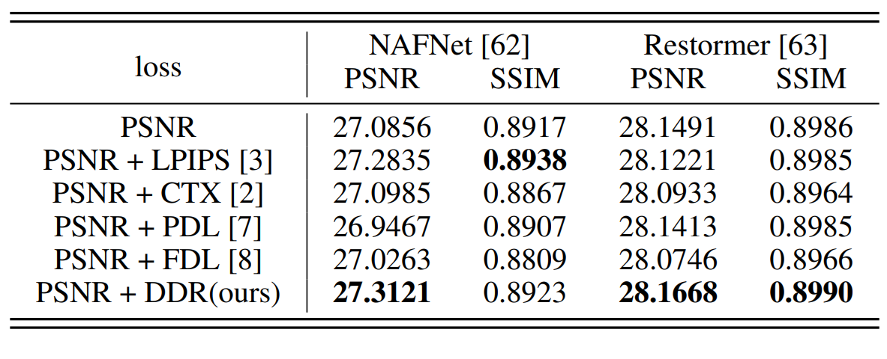

## DDR: Exploiting Deep Degradation Response as Flexible Image Descriptor

### The Thirty-Eighth Annual Conference on Neural Information Processing Systems (NeurIPS), 2024
<!-- **[NeurIPS-2024]** Pytorch implementation of "DDR: Exploiting Deep Degradation Response as Flexible Image Descriptor" -->

[Juncheng Wu](https://chtholly17.github.io/)<sup>1</sup>, [Zhangkai Ni](https://eezkni.github.io/)<sup>2</sup>, [Hanli Wang](https://mic.tongji.edu.cn/51/91/c9778a86417/page.htm)<sup>2</sup>, [Wenhan Yang](https://flyywh.github.io/)<sup>3</sup>, [Yuyin Zhou](https://yuyinzhou.github.io/)<sup>1</sup>, [Shiqi Wang](https://www.cs.cityu.edu.hk/~shiqwang/)<sup>4</sup>

<sup>1</sup>UC Santa Cruz, <sup>2</sup>Tongji University, <sup>3</sup>Pengcheng Laboratory, <sup>4</sup>City University of Hong Kong

This repository provides the official PyTorch implementation for the paper “DDR: Exploiting Deep Degradation Response as Flexible Image Descriptor”, NeurIPS-2024. [Paper](https://arxiv.org/abs/2406.08377)

<!--  -->
<div align="center">  </div>


## About DDR

Image deep features extracted by pre-trained networks are known to contain rich and informative representations. In this paper, we present Deep Degradation Response (DDR), a method to quantify changes in image deep features under varying
degradation conditions. Specifically, our approach facilitates flexible and adaptive degradation, enabling the controlled synthesis of image degradation through textdriven prompts. Extensive evaluations demonstrate the versatility of DDR as an image descriptor, with strong correlations observed with key image attributes such as complexity, colorfulness, sharpness, and overall quality. Moreover, we demonstrate the efficacy of DDR across a spectrum of applications. It excels as a blind image quality assessment metric, outperforming existing methodologies across multiple datasets. Additionally, DDR serves as an effective unsupervised learning objective in image restoration tasks, yielding notable advancements in image deblurring and single-image super-resolution.

**TL;DR:** We propose a novel image descriptor based on deep degradation response. We use pre-trained CLIP model to fuse text-guided degradation into image deep features. Our method demonstrates promising results on low-level tasks on opinion-unaware BIQA, image deblurring, and real-world image super-resolution.


## Experimental Results

### 1. Opinion-unaware BIQA

Performance comparisons of different OU-BIQA models on eight public datasets using SRCC. The top performer on each dataset is marked in **bold**.

<!--  -->
<div align="center">  </div>


### 2. Image Deblurring

Quantitative result of image motion deblurring. Combining proposed DDR with reconstruction loss leads to result with less degradation and higher fidelity. 

<!--  -->
<div align="center">  </div>


### 3. Real-world Image Super-resolution

Quantitative result on real-world SISR dataset

<!--  -->
<div align="center">  </div>


## Quick Start

- Python>=3.6
- Pytorch>=1.8
- PIL

```python
image = Image.open("test.png")
x = torch.stack([ToTensor()(image)]).to(device)	# to batch
criterion = DDR()
res = criterion(x)
```

## Citation

If you find our work useful, please cite it as

```
@article{wu2024ddr,
  title={DDR: Exploiting Deep Degradation Response as Flexible Image Descriptor},
  author={Wu, Juncheng and Ni, Zhangkai and Wang, Hanli and Yang, Wenhan and Zhou, Yuyin and Wang, Shiqi},
  journal={arXiv preprint arXiv:2406.08377},
  year={2024}
}
```

## Contact

Thanks for your attention! If you have any suggestion or question, feel free to leave a message here or contact Dr. Zhangkai Ni (eezkni@gmail.com) or Juncheng Wu (jwu418@ucsc.edu)


## License

[MIT License](https://opensource.org/licenses/MIT)
